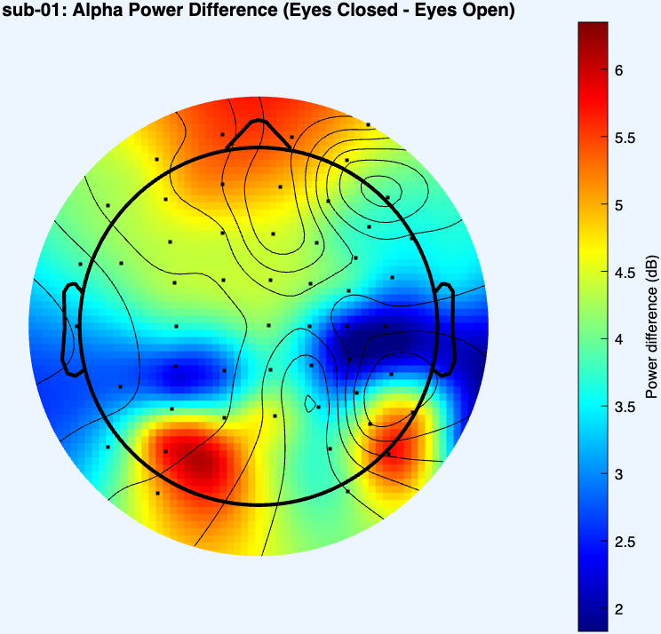

# scalp_topography


This repository contains MATLAB script (using EEGLAB) to compute and visualize the per-channel alpha-band (8–12 Hz) power difference between eyes-closed and eyes-open conditions. The key feature is that **only** the smooth, color-filled scalp map is rotated 90° clockwise, while contour lines, electrode markers, and the head outline remain in their original orientation.

## Files

- **rotate_fill_only.m**  
  A MATLAB function that:  
  1. Loads two EEGLAB `.set` files (eyes-closed and eyes-open).  
  2. Restricts the analysis to channels common to both recordings.  
  3. Computes per-channel power spectra (1–40 Hz) and averages the alpha band (8–12 Hz).  
  4. Computes an `alpha_diff` map (eyes-closed minus eyes-open).  
  5. Rotates only the filled scalp map by 90° clockwise.  
  6. Overlays unrotated contour lines, electrode markers, and head outline.  
  
## Prerequisites

- **MATLAB** R2019a (or later)  
- **[EEGLAB](https://sccn.ucsd.edu/eeglab/download.php)** toolbox installed  

## Usage

1. **Clone the repository**  

2. **Start MATLAB and add EEGLAB to your path (if not already added)**

3. **Call the function with your data folder and filenames**
 ```bash
 rotate_fill_only( ...
  '/Users/gaganmundada/Desktop/eyedataset', ...              % folder with your .set files
  'sub-01', ...                                              % subject label
  'sub-01_ses-session1_task-eyesclosed_eeg.set', ...         % eyes-closed filename
  'sub-01_ses-session1_task-eyesopen_eeg.set' ...            % eyes-open filename
);
```

<p align="center">
  
</p>